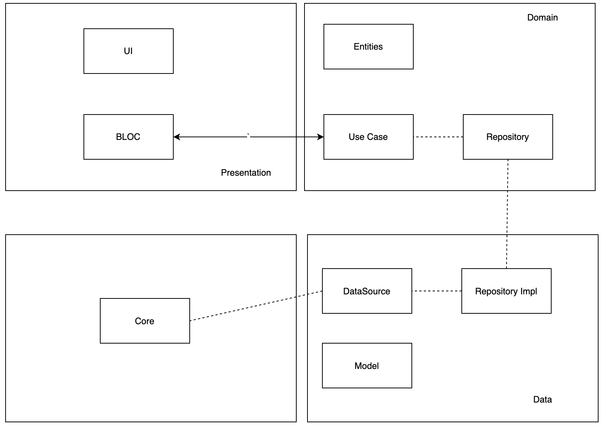
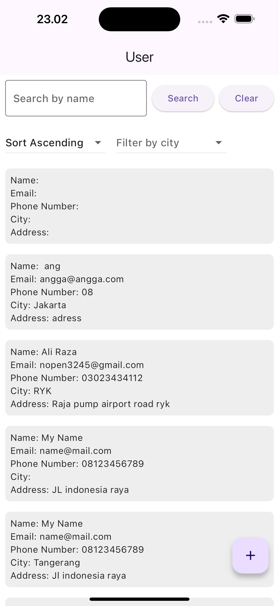
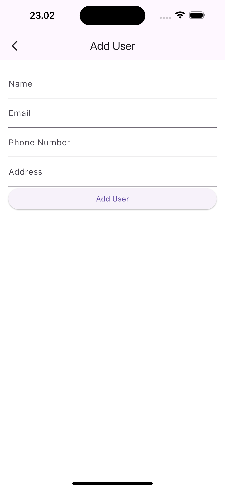

# Test_Accurate

## Cara Pengunaan Aplikasi

- Aplikasi hanya dibuka lalu akan muncul semua user yang terdapat di Server. 
pada tampilan pertama terdapat text field untuk search user dengan nama, bisa menekan enter atau menekan button search. jika ingin mereset filter atau search bisa menekan tombol search
- aplikasi pertama dibuat sudah sorting ascending by name.
- Sorting bisa dilakukan berdasarkan City.
- pada button floating ada button add, untuk menambahkan user. 

## Teknologi yang digunakan 
major depedencies
- Bloc
- Auto Route
- Get_It
- Injectable
- Dio
- Flavor
- Build Runner

## Folder Structure
```ascii
.
├── android
├── ios
├── lib
    ├── config
    ├── core
        ├── network
        ├── router
        ├── ...
    ├── feature
        ├── users
            ├── data
                ├── datasource
                ├── models
                ├── repositories
            ├── domain
                ├── entities
                ├── repository
                ├── use case
                ├── ...
            ├── presentation
                ├── pages
                ├── blocs
    ├── utils
    ├── app.dart
    ├── bootstrap.dart
    ├── main_dev.dart
    ├── main_prod.dart
    ├── main.dart
├── ...
```

Sebetulnya ini bisa ditingkatkan dengan mode modularization atau library package, sehingga nanti bisa multi app dengan core yang sama.
## Flow App


Pada Flow app diatas terdapat beberapa element, yaitu presentation, core, data, dan domain
dimana mereka berhubungan menggunakan depedency injection,

## Kenapa tampilan seperti itu. 
Sebenernya saya no idea buat tampilan saat ini, dikarenakan sedang ada kesibukan sehingga saya kurang performa dalam tampilan. hanya tampilan yang memuat semua soal. 

## ScreenShot tampilan

